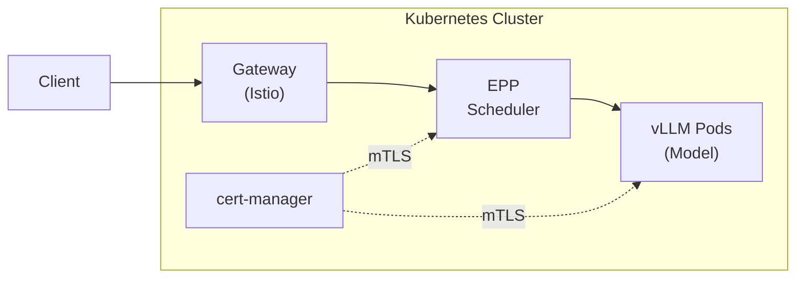

# Deploying Red Hat AI Inference Server on Managed Kubernetes

**Product:** Red Hat AI Inference Server (RHAIIS)
**Version:** 3.4
**Platforms:** Azure Kubernetes Service (AKS), CoreWeave Kubernetes Service (CKS)

---

## Executive Summary

This guide provides step-by-step instructions for deploying Red Hat AI Inference Server on managed Kubernetes platforms. Red Hat AI Inference Server enables enterprise-grade Large Language Model (LLM) inference with features including:

- **Intelligent request routing** using the Endpoint Picker Processor (EPP)
- **Disaggregated serving** with prefill-decode separation for optimal throughput
- **Multi-node inference** for large models using LeaderWorkerSet
- **Mutual TLS (mTLS)** for secure communication between components
- **Gateway API integration** for standard Kubernetes ingress

---

## Table of Contents

1. [Prerequisites](#1-prerequisites)
   - [Preflight Validation](#15-preflight-validation-recommended)
2. [Architecture Overview](#2-architecture-overview)
3. [Deploying All Components](#3-deploying-all-components)
4. [Configuring the Inference Gateway](#4-configuring-the-inference-gateway)
5. [Deploying an LLM Inference Service](#5-deploying-an-llm-inference-service)
6. [Verifying the Deployment](#6-verifying-the-deployment)
7. [Optional: Enabling Monitoring](#7-optional-enabling-monitoring)
8. [Collecting Debug Information](#8-collecting-debug-information)
9. [Troubleshooting](#9-troubleshooting)
10. [Appendix: Component Versions](#appendix-component-versions)

---

## 1. Prerequisites

### 1.1 Kubernetes Cluster Requirements

| Requirement | Specification |
|-------------|---------------|
| Kubernetes Version | 1.28 or later |
| Supported Platforms | AKS, CKS (CoreWeave) |
| GPU Nodes | NVIDIA A10, A100, or H100 (for GPU workloads) |
| NVIDIA Device Plugin | Installed and configured |

### 1.2 Client Tools

Install the following tools on your workstation:

| Tool | Minimum Version | Purpose |
|------|-----------------|---------|
| `kubectl` | 1.28+ | Kubernetes CLI |
| `helm` | 3.17+ | Helm package manager |
| `helmfile` | 0.160+ | Declarative Helm deployments |

### 1.3 Red Hat Registry Authentication

Red Hat AI Inference Server images are hosted on `registry.redhat.io` and require authentication.

**Procedure:**

1. Navigate to the Red Hat Registry Service Accounts page:
   https://access.redhat.com/terms-based-registry/

2. Click **New Service Account** and create a new service account.

3. Note the generated username (format: `12345678|account-name`) and password.

4. Authenticate with the registry:

   ```bash
   podman login registry.redhat.io
   ```

   Enter the service account username and password when prompted.

5. Verify authentication:

   ```bash
   # Verify access to Sail Operator image
   podman pull registry.redhat.io/openshift-service-mesh/istio-sail-operator-bundle:3.2

   # Verify access to RHAIIS vLLM image
   podman pull registry.redhat.io/rhaiis-tech-preview/vllm-openai-rhel9:latest
   ```

   Credentials are stored automatically in `~/.config/containers/auth.json` after successful login.

> **Note:** Registry Service Accounts do not expire and are recommended for production deployments.

### 1.4 GPU Node Pool Configuration

For GPU-accelerated inference, ensure your cluster has GPU nodes with the NVIDIA device plugin installed.

**Azure Kubernetes Service (AKS)**

For AKS cluster provisioning with GPU nodes, see:
- [AKS Provisioning Scripts](https://github.com/kwozyman/llm-d-xks-aks) - Automated cluster creation with GPU Operator
- [AKS Infrastructure Guide](https://llm-d.ai/docs/guide/InfraProviders/aks) - Manual setup instructions

**CoreWeave Kubernetes Service (CKS)**

CoreWeave clusters come with GPU nodes pre-configured. Select the appropriate GPU type when provisioning your cluster:

| GPU Type | Use Case |
|----------|----------|
| NVIDIA A100 80GB | Large models (70B+), high throughput |
| NVIDIA A100 40GB | Medium models (7B-30B) |
| NVIDIA H100 80GB | Maximum performance, largest models |

CoreWeave GPU nodes include the NVIDIA device plugin by default.

**Verification:**

```bash
kubectl get nodes -l nvidia.com/gpu.present=true
kubectl describe nodes | grep -A5 "nvidia.com/gpu"
```

---

## 1.5 Preflight Validation (Recommended)

Run the preflight validation checks to verify your cluster is properly configured:

```bash
# Build the validation container
cd validation && make container

# Run preflight checks against your cluster
make run
```

The preflight tool automatically detects your cloud provider and validates:

| Check | When it passes |
|-------|----------------|
| Cloud provider | Cluster is reachable and provider detected (pre-deployment) |
| Instance type | Supported GPU instance types are present (pre-deployment) |
| GPU availability | GPU drivers and node labels found (pre-deployment) |
| cert-manager CRDs | After `make deploy-all` |
| Sail Operator CRDs | After `make deploy-all` |
| LWS Operator CRDs | After `make deploy-all` |
| KServe CRDs | After `make deploy-all` |

> **Tip:** Run before deploying to verify cluster readiness (cloud provider, GPU, instance types). Run again after deployment to confirm all CRDs are installed. See Section 6.4 for full post-deployment validation.

See the [Preflight Validation README](../validation/README.md) for configuration options and standalone usage.

---

## 2. Architecture Overview

Red Hat AI Inference Server on managed Kubernetes consists of the following components:

| Component | Description |
|-----------|-------------|
| **cert-manager** | Manages TLS certificates for mTLS between components |
| **Istio (Sail Operator)** | Provides Gateway API implementation for inference routing |
| **LeaderWorkerSet (LWS)** | Enables multi-node inference for large models |
| **KServe Controller** | Manages LLMInferenceService lifecycle |
| **Inference Gateway** | Routes external traffic to inference endpoints |

### Component Interaction



---

## 3. Deploying All Components

### 3.1 Clone the Deployment Repository

```bash
git clone https://github.com/opendatahub-io/rhaii-on-xks.git
cd rhaii-on-xks
```

### 3.2 Deploy

Deploy cert-manager, Istio (Sail Operator), LeaderWorkerSet, and KServe:

```bash
make deploy-all
```

> **Note:** To deploy components individually, use `make deploy-cert-manager`, `make deploy-istio`, `make deploy-lws`, and `make deploy-kserve`.

### 3.3 Verify Infrastructure Deployment

```bash
make status
```

**Expected output:**

```text
=== Deployment Status ===
cert-manager-operator:
NAME                                       READY   STATUS    RESTARTS   AGE
cert-manager-operator-xxxxxxxxx-xxxxx      1/1     Running   0          5m

cert-manager:
NAME                                       READY   STATUS    RESTARTS   AGE
cert-manager-xxxxxxxxx-xxxxx               1/1     Running   0          5m
cert-manager-cainjector-xxxxxxxxx-xxxxx    1/1     Running   0          5m
cert-manager-webhook-xxxxxxxxx-xxxxx       1/1     Running   0          5m

istio:
NAME                                       READY   STATUS    RESTARTS   AGE
istiod-xxxxxxxxx-xxxxx                     1/1     Running   0          5m

lws-operator:
NAME                                       READY   STATUS    RESTARTS   AGE
lws-controller-manager-xxxxxxxxx-xxxxx     1/1     Running   0          5m

=== API Versions ===
InferencePool API: v1 (inference.networking.k8s.io)
Istio version: v1.27.5
```

> **TLS Certificates:** The default configuration uses a self-signed CA for internal mTLS between inference components (router, scheduler, vLLM). This is sufficient for most deployments as the certificates are only used for pod-to-pod communication within the cluster. If your organization requires certificates issued by a corporate PKI, replace the `opendatahub-selfsigned-issuer` with a cert-manager ClusterIssuer backed by your CA (e.g., Vault, AWS ACM PCA, or an external PKI). See the [KServe Chart README - cert-manager PKI Setup](https://github.com/opendatahub-io/rhaii-on-xks/blob/main/charts/kserve/README.md#cert-manager-pki-setup) for details. The KServe chart version is configured in `values.yaml` (`kserveChartVersion`). See the [KServe Chart README](https://github.com/opendatahub-io/rhaii-on-xks/blob/main/charts/kserve/README.md) for chart details and cert-manager PKI prerequisites.

---

## 4. Configuring the Inference Gateway

### 4.1 Create the Gateway

Run the gateway setup script:

```bash
./scripts/setup-gateway.sh
```

This script:
1. Copies the CA bundle from cert-manager to the opendatahub namespace
2. Creates an Istio Gateway with the CA bundle mounted for mTLS
3. Configures the Gateway pod with registry authentication

### 4.2 Verify Gateway Deployment

```bash
kubectl get gateway -n opendatahub
```

**Expected output:**

```text
NAME                CLASS   ADDRESS         PROGRAMMED   AGE
inference-gateway   istio   20.xx.xx.xx     True         1m
```

Verify the Gateway pod is running:

```bash
kubectl get pods -n opendatahub -l gateway.networking.k8s.io/gateway-name=inference-gateway
```

### 4.3 AKS: Fix Load Balancer Health Probe

On AKS, external traffic to the inference gateway on port 80 may time out due to the Azure Load Balancer using an HTTP health probe that fails against the Istio gateway. This is handled automatically by `setup-gateway.sh` on AKS.

If you need to apply it manually (e.g., after recreating the Gateway):

```bash
kubectl annotate svc inference-gateway-istio -n opendatahub \
  "service.beta.kubernetes.io/port_80_health-probe_protocol=tcp" \
  --overwrite
```

> **Note:** The port number in the annotation must match the Gateway listener port (`80` here, as configured in `setup-gateway.sh`). If the Gateway is deleted and recreated without re-running `setup-gateway.sh`, the annotation will be lost and must be reapplied. See [Azure LB Health Probe Workaround](./azure-lb-health-probe-workaround.md) for full details.

---

## 5. Deploying an LLM Inference Service

### 5.1 Create the Application Namespace

```bash
export NAMESPACE=llm-inference
kubectl create namespace $NAMESPACE
```

### 5.2 Configure Registry Authentication

Copy the pull secret to your application namespace:

```bash
kubectl get secret redhat-pull-secret -n istio-system -o json | \
  jq 'del(.metadata.resourceVersion, .metadata.uid, .metadata.creationTimestamp, .metadata.annotations, .metadata.labels) | .metadata.namespace = "'$NAMESPACE'"' | \
  kubectl create -f -
```

Configure the default ServiceAccount:

```bash
kubectl patch serviceaccount default -n $NAMESPACE \
  -p '{"imagePullSecrets": [{"name": "redhat-pull-secret"}]}'
```

### 5.3 Deploy the LLMInferenceService

Create the LLMInferenceService resource:

```bash
kubectl apply -n $NAMESPACE -f - <<'EOF'
apiVersion: serving.kserve.io/v1alpha1
kind: LLMInferenceService
metadata:
  name: qwen2-7b-instruct
spec:
  model:
    name: Qwen/Qwen2.5-7B-Instruct
    uri: hf://Qwen/Qwen2.5-7B-Instruct
  replicas: 1
  router:
    gateway: {}
    route: {}
    scheduler: {}
  template:
    tolerations:
    - key: "nvidia.com/gpu"
      operator: "Equal"
      value: "present"
      effect: "NoSchedule"
    containers:
    - name: main
      resources:
        limits:
          cpu: "4"
          memory: 32Gi
          nvidia.com/gpu: "1"
        requests:
          cpu: "2"
          memory: 16Gi
          nvidia.com/gpu: "1"
      livenessProbe:
        httpGet:
          path: /health
          port: 8000
          scheme: HTTPS
        initialDelaySeconds: 120
        periodSeconds: 30
        timeoutSeconds: 30
        failureThreshold: 5
EOF
```

### 5.4 Monitor Deployment Progress

Watch the LLMInferenceService status:

```bash
kubectl get llmisvc -n $NAMESPACE -w
```

The service is ready when the `READY` column shows `True`.

---

## 6. Verifying the Deployment

### 6.1 Check Service Status

```bash
kubectl get llmisvc -n $NAMESPACE
```

**Expected output:**

```text
NAME                READY   URL                                    AGE
qwen2-7b-instruct   True    http://20.xx.xx.xx/llm-inference/...   5m
```

### 6.2 Check Pod Status

```bash
kubectl get pods -n $NAMESPACE
```

All pods should show `Running` status with `1/1` or `2/2` ready containers.

### 6.3 Test Inference

Retrieve the service URL:

```bash
SERVICE_URL=$(kubectl get llmisvc qwen2-7b-instruct -n $NAMESPACE -o jsonpath='{.status.url}')
echo $SERVICE_URL
```

Send a test request:

```bash
curl -X POST "${SERVICE_URL}/v1/chat/completions" \
  -H "Content-Type: application/json" \
  -d '{
    "model": "Qwen/Qwen2.5-7B-Instruct",
    "messages": [{"role": "user", "content": "What is Kubernetes?"}],
    "max_tokens": 100
  }'
```

### 6.4 Run Preflight Validation

Run the full validation suite to confirm all components are properly installed:

```bash
cd validation && make container && make run
```

All checks should show `PASSED`:

```text
cloud_provider   PASSED
instance_type    PASSED
gpu_availability PASSED
crd_certmanager  PASSED
crd_sailoperator PASSED
crd_lwsoperator  PASSED
crd_kserve       PASSED
```

If any checks fail, review the suggested actions in the output. See the [Preflight Validation README](../validation/README.md) for configuration options.

---

## 7. Optional: Enabling Monitoring

Monitoring is disabled by default. Enable it if you need:
- Grafana dashboards for inference metrics
- Workload Variant Autoscaler (WVA) for auto-scaling

### 7.1 Prerequisites

Install Prometheus with ServiceMonitor/PodMonitor CRD support. See the [Monitoring Setup Guide](../monitoring-stack/) for platform-specific instructions.

### 7.2 Enable Monitoring in KServe

```bash
kubectl set env deployment/kserve-controller-manager \
  -n opendatahub \
  LLMISVC_MONITORING_DISABLED=false
```

When enabled, KServe automatically creates `PodMonitor` resources for vLLM pods.

### 7.3 Verify

```bash
# Check PodMonitors created by KServe
kubectl get podmonitors -n <llmisvc-namespace>
```

---

## 8. Collecting Debug Information

If you encounter issues during or after deployment, collect diagnostic data for troubleshooting:

```bash
./scripts/collect-debug-info.sh
```

This produces a directory containing logs, resource status, certificate info, and warning events for all components. To package for sharing with Red Hat support:

```bash
tar -czf rhaii-debug.tar.gz -C /tmp rhaii-on-xks-debug-*
```

**What is collected:**

| Category | Details |
|----------|---------|
| Cluster | Kubernetes version, node info, Helm releases |
| cert-manager | Operator/controller/webhook logs, certificates, issuers |
| Istio | Sail operator/istiod logs, gateways, HTTPRoutes, InferencePools |
| LWS | Operator logs, LeaderWorkerSets, webhook configs |
| KServe | Controller logs, LLMInferenceServices, gateway status |
| Events | Warning/error events from all operator namespaces |

See the full guide: [Collecting Debug Information](./collecting-debug-information.md)

---

## 9. Troubleshooting

### 9.1 Controller Pod Stuck in ContainerCreating

**Symptom:** The `kserve-controller-manager` pod remains in `ContainerCreating` state.

**Cause:** The webhook certificate has not been issued by cert-manager.

**Resolution:**

Verify the cert-manager PKI resources are applied (the KServe chart expects `opendatahub-ca-issuer` ClusterIssuer):

```bash
kubectl get clusterissuer opendatahub-ca-issuer
kubectl get certificate -n cert-manager

# If missing, re-run the deployment
make deploy-kserve
```

### 9.2 Gateway Pod Shows ErrImagePull

**Symptom:** The Gateway pod fails with `ErrImagePull` or `ImagePullBackOff`.

**Cause:** The Gateway ServiceAccount does not have registry authentication configured.

**Resolution:**

```bash
kubectl get secret redhat-pull-secret -n istio-system -o json | \
  jq 'del(.metadata.resourceVersion, .metadata.uid, .metadata.creationTimestamp, .metadata.annotations, .metadata.labels) | .metadata.namespace = "opendatahub"' | \
  kubectl create -f -

kubectl patch sa inference-gateway-istio -n opendatahub \
  -p '{"imagePullSecrets": [{"name": "redhat-pull-secret"}]}'

kubectl delete pod -n opendatahub -l gateway.networking.k8s.io/gateway-name=inference-gateway
```

### 9.3 LLMInferenceService Pod Shows FailedScheduling

**Symptom:** The inference pod shows `FailedScheduling` with message "Insufficient nvidia.com/gpu".

**Cause:** No GPU nodes are available or the pod lacks required tolerations.

**Resolution:**

1. Verify GPU nodes are available:
   ```bash
   kubectl get nodes -l nvidia.com/gpu.present=true
   ```

2. Check node taints:
   ```bash
   kubectl get nodes -o jsonpath='{range .items[*]}{.metadata.name}: {.spec.taints}{"\n"}{end}'
   ```

3. Add matching tolerations to the LLMInferenceService spec (see Section 5.3).

### 9.4 Webhook Validation Errors During Deployment

**Symptom:** Deployment fails with "no endpoints available for service" webhook errors.

**Cause:** Webhooks are registered before the controller is ready.

**Resolution:**

```bash
# Delete stale webhooks
kubectl delete validatingwebhookconfiguration \
  llminferenceservice.serving.kserve.io \
  llminferenceserviceconfig.serving.kserve.io \
  --ignore-not-found

# Re-deploy KServe
make deploy-kserve
```

---

## Appendix: Component Versions

| Component | Version | Container Image |
|-----------|---------|-----------------|
| cert-manager Operator | 1.15.2 | `registry.redhat.io/cert-manager/cert-manager-operator-rhel9` |
| Sail Operator (Istio) | 3.2.1 | `registry.redhat.io/openshift-service-mesh/istio-sail-operator-bundle:3.2` |
| Istio | 1.27.x | Dynamic resolution via `v1.27-latest` |
| LeaderWorkerSet | 1.0 | `registry.k8s.io/lws/lws-controller` |
| KServe Controller | 0.15 (chart 3.4.0-ea.1) | `registry.redhat.io` (via `charts/kserve/`) |
| vLLM | Latest | `registry.redhat.io/rhaiis-tech-preview/vllm-openai-rhel9` |

### API Versions

| API | Group | Version | Status |
|-----|-------|---------|--------|
| InferencePool | `inference.networking.k8s.io` | v1 | GA |
| InferenceModel | `inference.networking.x-k8s.io` | v1alpha2 | Alpha |
| LLMInferenceService | `serving.kserve.io` | v1alpha1 | Alpha |
| Gateway | `gateway.networking.k8s.io` | v1 | GA |

---

## Support

For assistance with Red Hat AI Inference Server deployments, contact Red Hat Support or consult the product documentation.

**Additional Resources:**

* [KServe Chart README](https://github.com/opendatahub-io/rhaii-on-xks/blob/main/charts/kserve/README.md) - KServe Helm chart details, PKI prerequisites, and OCI registry install
* [Preflight Validation](https://github.com/opendatahub-io/rhaii-on-xks/blob/main/validation/README.md) - Cluster readiness and post-deployment validation checks
* [Monitoring Setup Guide](../monitoring-stack/) - Optional Prometheus/Grafana configuration for dashboards and autoscaling
* [KServe LLMInferenceService Samples](https://github.com/red-hat-data-services/kserve/tree/rhoai-3.4/docs/samples/llmisvc)
